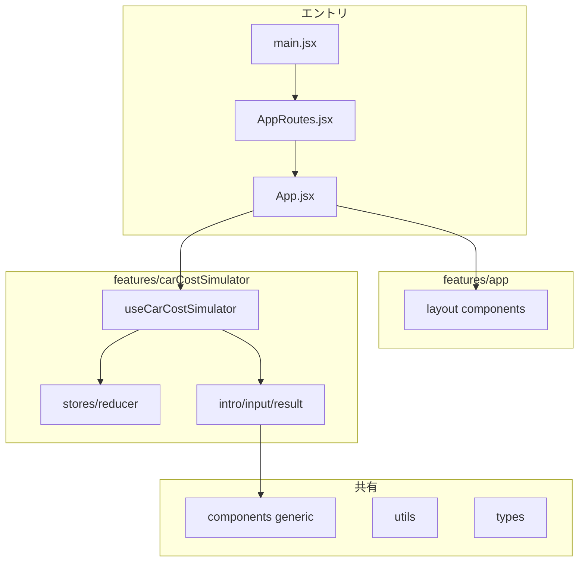

# src フォルダ再構成プラン

## 現状とのギャップ


| ご提示のフォルダ         | このアプリの現状                                                                                                     |
| ---------------- | ------------------------------------------------------------------------------------------------------------ |
| `routes`         | [main.jsx](frontend/src/main.jsx) が `BrowserRouter` + [App.jsx](frontend/src/App.jsx) を直接マウントのみ（ルート定義ファイルなし） |
| `schemas`        | 未使用（PHP API 直叩き、`constants.js` のみ）                                                                           |
| `stores`（Redux）  | **未使用**（状態は `App.jsx` の `useState` に集中）                                                                      |
| `types`          | 未使用（JS のみ、`@types/react` は dev のみ）                                                                           |
| `utils`          | 未使用（`escapeCsvCell` 等が `App.jsx` 内）                                                                          |
| `components`（汎用） | [components/ui](frontend/src/components/ui) に一部あるが、`layout` / `simulator` も同列に存在                             |
| `features`       | 未使用（機能は `components/simulator` + 巨大 `App.jsx`）                                                               |


拡張子は **現状どおり `.jsx` / `.js`** とし、型は `**types` に JSDoc（`@typedef`）** または将来 TypeScript 化用の `.d.ts` を置く形でよい（ご提示の `.d.ts` は「グローバル型」のイメージに合わせる）。

---

## 目標ツリー（提案）

フォルダ名の typo（`compenents`）は `**components` に統一**します。

```text
frontend/src/
├── main.jsx
├── index.css
├── App.jsx                    # 薄くする（ルート合成 or features/app からの再エクスポート）
├── routes/
│   └── AppRoutes.jsx          # <Routes> … 現状は path="/" のみでよい
├── schemas/                   # 今回は「車・計算API」のフィールドメタ（任意で最小）
│   └── carFields.js           # max / step 等をオブジェクト化（DB連想の置き場）
├── stores/                    # グローバル Redux 用（現状はプレースホルダー）
│   └── index.js               # 将来: configureStore / Provider 差し込み口
├── types/
│   └── index.js               # 共通 JSDoc（ApiErrorShape, SelectOption 等）
├── utils/
│   ├── csv.js                 # escapeCsvCell
│   └── numberFormat.js        # formatEngineToThreeDecimals 等
├── config/                    # または utils/constants.js
│   └── constants.js           # 現 [constants.js](frontend/src/constants.js) を移動
├── components/                # 機能非依存の汎用 UI のみ
│   ├── SpaSectionLead.jsx + .css
│   ├── CalcButton.*
│   ├── CsvExportButton.* / CsvImportButton.* / CsvButtons.css
│   └── ResultDownloadButton.*
├── features/
│   ├── app/
│   │   ├── components/
│   │   │   └── layout/        # AppHeader, AppFooter, SpaLeftNav + 各 CSS
│   │   ├── hooks/             # 必要なら useFooterNavigation 等の薄いフック
│   │   ├── stores/            # アプリ全体で共有する state が出たら（空でも可）
│   │   └── types/
│   └── carCostSimulator/      # 「車の維持費シミュレータ」機能（旧 simulator）
│       ├── components/
│       │   ├── intro/         # SimulatorIntro + CSS
│       │   ├── input/         # SimulatorInput + CSS
│       │   └── result/        # ResultSection + CSS
│       ├── hooks/
│       │   └── useCarCostSimulator.js   # 車一覧取得・計算・CSV・ナビゲーションを集約
│       ├── stores/
│       │   ├── initialState.js
│       │   └── simulatorReducer.js      # useReducer 用（Redux 未導入でも「stores」役を満たす）
│       └── types/
│           └── simulator.types.js       # Car / CalcResult 等（JSDoc）
```

**機能名**は `carCostSimulator`（ASCII・意味が明確）を提案。リネーム希望があれば `simulator` でも可。




---

## 実装ステップ（推奨順）

1. **土台フォルダの追加**
  `routes`, `schemas`, `stores`, `types`, `utils`, `config`（または `utils` 直下に constants）を作成。
2. **設定・ユーティリティの移動**
  - [constants.js](frontend/src/constants.js) → `config/constants.js`（import を一括更新）  
  - `escapeCsvCell` / `formatEngineToThreeDecimals` → `utils/csv.js` / `utils/numberFormat.js`
3. **汎用 `components` の整理**
  現 [components/ui](frontend/src/components/ui) を [src/components](frontend/src/components) 直下へ移動（`layout` / `simulator` は削除し、後述の `features` へ）。
4. `**features/app` へレイアウト移動**
  現 [components/layout](frontend/src/components/layout) → `features/app/components/layout/`  
   インポート元は `App.jsx` および再エクスポート経由に統一。
5. `**features/carCostSimulator` へ画面移動**
  現 [components/simulator](frontend/src/components/simulator) を `intro` / `input` / `result` サブフォルダに分割して配置。  
   各ファイル内の `../ui/...` は `../../../components/...` に変更。
6. `**App.jsx` の分割（最重要）**
  - 状態・副作用・ハンドラを `**useCarCostSimulator.js`** に移動。  
  - 状態が大きいため `**useReducer` + `initialState.js` + `simulatorReducer.js`** に載せ替えると、`features/.../stores` の役割と一致し、テストもしやすい。  
  - Redux は**今回入れない**前提（ご提示の `src/stores` は `stores/index.js` に「将来ここで combineReducer」コメントのみ、または空エクスポート）。Redux 導入は別タスクにすると差分が読みやすい。
7. `**routes` の導入**
  [main.jsx](frontend/src/main.jsx) は `<BrowserRouter><AppRoutes /></BrowserRouter>` のみにし、[routes/AppRoutes.jsx](frontend/src/routes/AppRoutes.jsx) で `<Routes><Route path="/*" element={<App />} /></Routes>` を定義。将来 `/privacy` 等を足しやすい。
8. `**schemas` の最小例**
  入力の `max` / `step` 等を [SimulatorInput.jsx](frontend/src/components/simulator/SimulatorInput.jsx) から参照できるよう、`schemas/carFields.js` にオブジェクト化（マジックナンバー削減の足がかり）。必須ではないが、フォルダの意味付けとして有効。
9. **グローバル `types`**
  `types/index.js` に `@typedef` で `Car`, `CalcResult`, `ImportMessage` 等を宣言し、hooks / reducer から参照。
10. **検証**
  `npm run lint` / `npm run build`。Vite の `resolve.alias`（`@/`）は任意（入れると import が短くなる）。

---

## 注意点

- **Redux**: ご説明どおり `src/stores` は「Redux 用」の定位置としつつ、**現コードベースには未導入**のため、第1段は `**useReducer` を `features/carCostSimulator/stores` に置く**形が、フォルダ意図と実装コストのバランスがよいです。  
- **schemas**: フロントに DB 定義が無いため、**API／CSV と整合するフィールド定義**として薄く始めるのが現実的です。  
- [App.css](frontend/src/App.css) はルート直下のままか、`features/app/App.css` に移すかは好み（クラス名 `.app` はグローバルなので、移動時は import パスだけ合わせればよい）。

---

## 変更の主なファイル

- 新規: `routes/AppRoutes.jsx`, `features/carCostSimulator/hooks/useCarCostSimulator.js`, reducer 一式, `utils/`*, `types/index.js`, 任意 `schemas/carFields.js`  
- 大規模更新: [App.jsx](frontend/src/App.jsx)（薄型化）, [main.jsx](frontend/src/main.jsx)  
- 移動・import 更新: 全コンポーネント・CSS の相対パス

